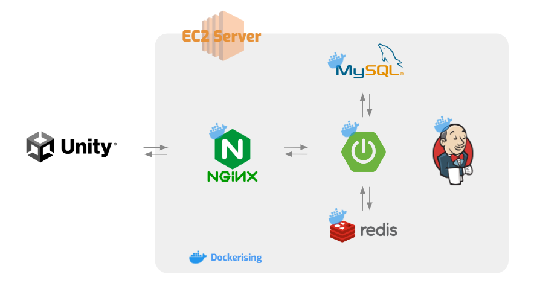

# 🌼GARDENERY🌼

## 1. 서비스 소개

바쁜 현대인들을 위한 힐링 다이어리 서비스

## 2. 팀 소개

| 팀원 | 고나령 | 김진회 | 신성은 | 이선민 | 최수빈 | 하규진 |
| --- | --- | --- | --- | --- | --- | --- |
| 역할 | 팀장 / BackEnd / Unity | BackEnd / Unity | BackEnd / Unity | 부팀장 / Unity | Unity | Unity |

## 3. 기술 스택🛠

**Front-end**

- Unity 2021.3.9.f1
- VisualStudio 2019
- Plastic

**Back-end**

- JAVA 11
- Spring Boot 2.7.4
- Spring Security
- Hibernate
- JPA
- Gradle 7.5
- JWT 0.9.1
- MapStruct 1.5.2

**Database**

- Redis 7.0.4
- MySQL

**Infra**

- NginX
- AWS EC2 Ubuntu 20.04 LTS
- Docker 20.10.18
- Docker Compose 1.29.2
- Jenkins

## 4. 서비스 아키텍처

## 5. 기능 소개🔍

### 5-1-1 로그인 화면

앱 실행 시 소셜 로그인이 가능합니다.

처음 로그인한 경우 회원 가입으로 취급되며 자동 생성된 닉네임과 기본 캐릭터로 서비스를 이용할 수 있습니다. 

### 5-2-1 메인 화면

자신이 설정한 캐릭터 중심으로 화면을 확인할 수 있습니다.

책상을 클릭하여 책상 앞으로 이동할 수 있습니다.

텃밭 / 정원 근처로 가면 포털을 통해 해당 신으로 이동할 수 있습니다. 

### 5-2-2 메인 화면 책상

책상에 올려져 있는 꽃 일기와 나무 일기를 선택하여 해당 작성 기록을 확인할 수 있습니다.

꽃 일기에서는 작성했던 질문과 답 목록을 확인할 수 있습니다.

나무 일기에서는 날짜를 선택해 해당 날짜에 작성한 일기 목록을 확인할 수 있습니다.

### 5-3-1 메뉴 바

메인 화면 하단 메뉴 바에서 친구/도감/마이페이지 버튼을 클릭하면 해당 화면을 확인할 수 있습니다.

### 5-4-1 텃밭 꽃

텃밭에서 꽃은 경험치에 따라 다른 모양으로 표시됩니다.

꽃을 누르면 질문을 확인하고 답을 작성할 수 있습니다.

이미 오늘 답을 작성했다면 꽃을 누를 수 없습니다.

꽃 경험치는 답을 작성한 경우 새벽 3시 기준 하루에 한 번 획득 가능합니다.

질문은 새벽 3시 기준 하루에 한 번 랜덤으로 갱신됩니다.

꽃의 경험치가 100이 되어 성장을 완료한 경우 어떤 꽃을 획득했는지 확인할 수 있고 새로운 꽃을 얻습니다.

### 5-4-2 텃밭 나무

텃밭에서 나무는 경험치에 따라 다른 모양으로 표시됩니다.

나무를 누르면 일기를 작성할 수 있습니다.

일기는 하루에 여러 개 작성 가능하며 날짜를 선택해 다른 날짜의 일기도 작성할 수 있습니다.

나무 경험치는 일기를 작성한 경우 새벽 3시 기준 하루에 한 번 획득 가능합니다.

나무의 경험치가 100이 되어 성장을 완료한 경우 어떤 나무를 획득했는지 확인할 수 있고 새로운 나무를 얻습니다.

### 5-5-1 정원

자신이 꾸민 정원 모습을 확인할 수 있습니다.

정원에서 꽃 / 나무를 클릭하면 그에 해당하는 일기 목록을 확인할 수 있습니다.

### 5-5-2 정원 꾸미기

인벤토리 버튼을 눌러 자신이 가지고 있는 꽃 / 나무/ 아이템을 탭으로 구분해 확인할 수 있습니다.

배치를 수정하고 저장할 수 있습니다.

### 5-6-1 친구

친구 목록에서 자신의 팔로잉 / 팔로워 목록을 확인할 수 있습니다.

검색 버튼을 통해 닉네임으로 사용자를 검색할 수 있습니다.

현재 자신이 팔로우하지 않는 사용자를 누른 경우 친구 추가하기 버튼을 통해 팔로우할 수 있습니다.

현재 자신이 팔로우하는 사용자를 누른 경우 친구 삭제하기 버튼을 통해 팔로우를 취소할 수 있습니다.

### 5-7-1 식물 도감 꽃

꽃 도감에서 자신이 획득한 꽃들과 획득하지 못한 꽃들을 모두 확인할 수 있습니다.

획득한 꽃을 누르면 꽃에 대한 간단한 설명을 확인할 수 있습니다.

### 5-7-2 식물 도감 나무

나무 도감에서 자신이 획득한 나무들과 획득하지 못한 나무들을 모두 확인할 수 있습니다.

획득한 나무를 누르면 나무에 대한 간단한 설명을 확인할 수 있습니다.

### 5-8-1 마이페이지

상단에서 현재 캐릭터와 닉네임을 확인할 수 있습니다.

닉네임 변경 버튼을 통해 닉네임을 변경할 수 있고 중복된 닉네임 및 15자 초과되는 닉네임은 사용할 수 없습니다.

하단 캐릭터 목록에서 자신이 획득한 캐릭터들과 획득하지 못한 캐릭터들을 모두 확인할 수 있습니다.

획득한 캐릭터를 선택할 경우 현재 캐릭터의 변경 여부를 묻는 팝업을 확인할 수 있습니다.

획득하지 못한 캐릭터를 선택할 경우 캐릭터 획득 조건을 확인할 수 있습니다.

오른쪽 하단 Main 버튼을 통해 마이페이지 패널을 종료하여 메인 화면을 확인할 수 있습니다.

### 5-9-1 부가 기능 캐릭터

캐릭터 획득 조건을 달성하면 해당 캐릭터를 획득할 수 있습니다.

캐릭터 획득 조건은 마이페이지에서 확인할 수 있습니다.

### 5-9-2 부가 기능 아이템

꽃 / 나무 일기를 2일 연속 작성한 경우 아이템을 랜덤으로 획득할 수 있습니다.

획득한 아이템은 정원을 꾸밀 때 사용할 수 있습니다.
